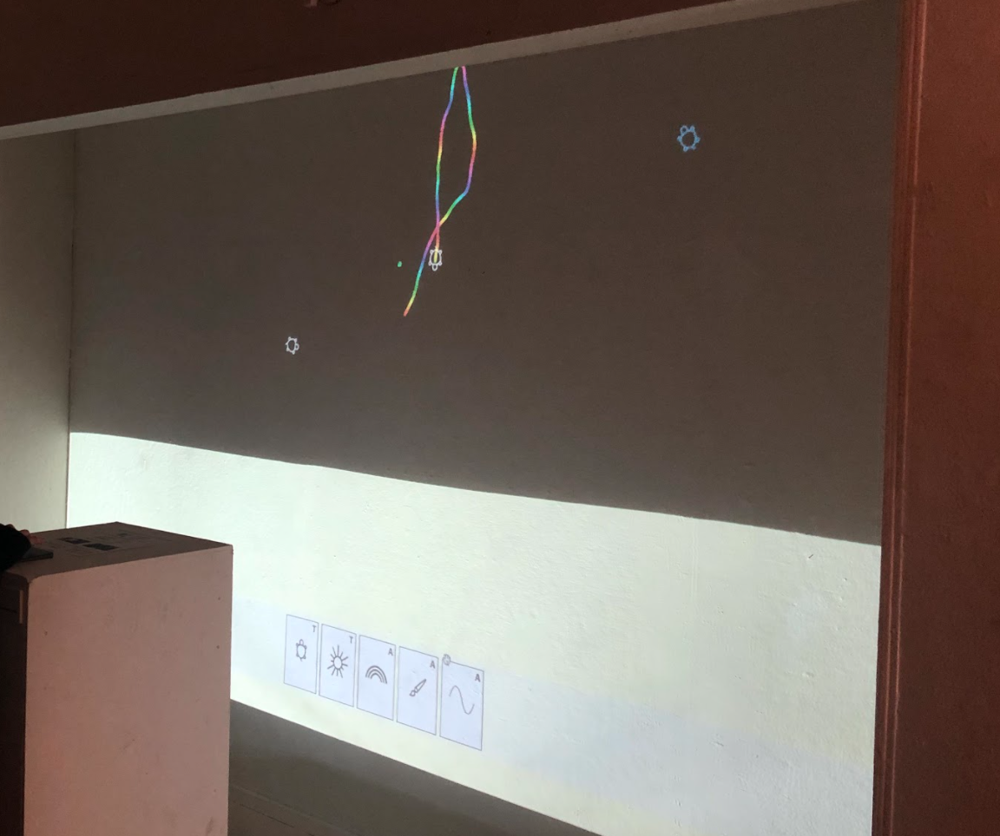

Artifacts of the Artificial was an installation show I made with [Cameron Burgess](https://cameron-burgess.com/) in Fall of 2019. It was inside CMU's on-campus [Frame gallery](https://www.facebook.com/theframegallerycmu/).

(thanks to Cameron for making the kickass display and pretty much all of the rest of the show)

One Artifact we made was [Folia](https://a9.io/folia). Try combining the cards together!

[Jacob Haip](https://haiperspace.com/) made a physical version (!!!)

<iframe src="https://player.vimeo.com/video/396850279" width="640" height="1138" frameborder="0" allow="autoplay; fullscreen; picture-in-picture" allowfullscreen></iframe>

<a href="https://vimeo.com/396850279">Turtle Cards</a> from <a href="https://vimeo.com/user108515692">Jacob Haip</a> on <a href="https://vimeo.com">Vimeo</a>.

Cameron and [Maayan Albert](http://www.maayanalbert.com/) also displayed Stamper:

<blockquote class="twitter-tweet">
<a href="https://twitter.com/maayan_albert?ref_src=twsrc%5Etfw">@maayan_albert</a> and I are extremely excited to share Stamper, a project we worked on together to create  “a <a href="https://twitter.com/p5xjs?ref_src=twsrc%5Etfw">@p5xjs</a> editor in shape of <a href="https://twitter.com/sketch?ref_src=twsrc%5Etfw">@sketch</a>”  Try 🤚 it: <a href="https://t.co/AHP2f38qwt">https://t.co/AHP2f38qwt</a>  Watch the full 🎞 video: <a href="https://t.co/AEJwjbBTkY">https://t.co/AEJwjbBTkY</a> <a href="https://t.co/B3a3eMN05k">pic.twitter.com/B3a3eMN05k</a>
&mdash; cameron burgess (@supercgeek) <a href="https://twitter.com/supercgeek/status/1230163240815955968?ref_src=twsrc%5Etfw">February 19, 2020</a></blockquote> 

[[theory.materiality]]
