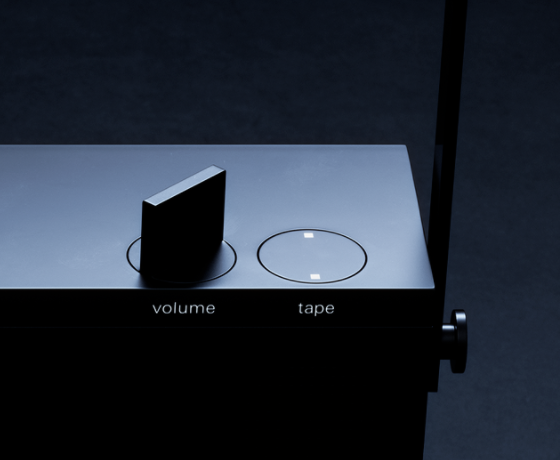

<blockquote class="twitter-tweet">
how do u even make mixtapes without a tape... damn
&mdash; Max Krieger (@maxkriegers) <a href="https://twitter.com/maxkriegers/status/1303818284962377728?ref_src=twsrc%5Etfw">September 9, 2020</a></blockquote> 

Is there software to do this? You could record a DJ session with DJ software sure.

Can we make a fun tool like the dial in Teenage Engineering's new [OB-4](https://teenage.engineering/products/ob-4)?

I love the momentum and physical sound of rewinding on the OP-1:

<iframe width="560" height="315" src="https://www.youtube.com/embed/gCA4I-yRbAs?start=12" frameborder="0" allow="accelerometer; autoplay; clipboard-write; encrypted-media; gyroscope; picture-in-picture" allowfullscreen></iframe>

also

<iframe width="560" height="315" src="https://www.youtube.com/embed/9uKRqS98kIg" frameborder="0" allow="accelerometer; autoplay; clipboard-write; encrypted-media; gyroscope; picture-in-picture" allowfullscreen></iframe>

Rob Ochshorn also made a fantastic "seeking sound effect" here http://rmozone.com/snapshots/2015/06/transcript-video-player/

...and a TMNT record scratch effect http://rmozone.com/snapshots/2014/12/audiojerk.html

Related: [[rethinking-media.video-associations]]
