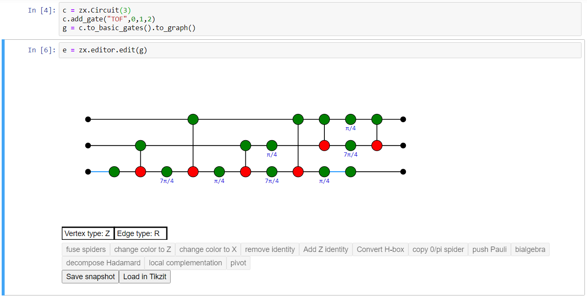

([PyZX](https://pyzx.readthedocs.io/en/latest/graph.html#the-zx-diagram-editor))

I loved Papert's Mindstorms. Part of why it resonated is simply because I like using programming to learn stuff. Not everyone likes that, but I think it's still worth exploring how domain specific languages can guide self-directed learning.

It's worth mentioning that Sam Ritchie already outlined, like, a lot of this, in [The Dynamic Notebook](https://roadtoreality.substack.com/p/the-dynamic-notebook) and his ongoing effort to port [SICM](https://mitpress.mit.edu/books/structure-and-interpretation-classical-mechanics) there.

[ProbMods](https://probmods.org/chapters/social-cognition.html)

- [ ] Are these [Enabling Environments](https://notes.andymatuschak.org/z3DaBP4vN1dutjUgrk3jbEeNxScccvDCxDgXe)?

## Examples

- [Calculus with Julia](https://juliahub.com/docs/CalculusWithJulia/AZHbv/0.0.5/)
  - [Math 229 Projects](http://mth229.github.io/) (College of Staten Island course on calculus with julia)
- [Statistics with Julia](https://statisticswithjulia.org/)
- [Computational thinking (modeling) with Julia](https://computationalthinking.mit.edu/Fall20/)
- [Designing Sound](https://mitpress.mit.edu/books/designing-sound) (with Pd)
- [Structure and Interpretation of Classical Mechanics](https://mitpress.mit.edu/books/structure-and-interpretation-classical-mechanics) (in Scheme)
- [Functional Differential Geometry](https://mitpress.mit.edu/books/functional-differential-geometry) (in Scheme)
- [Qiskit](https://github.com/Qiskit/qiskit/)
- [Programming Language Foundations in Agda](https://plfa.github.io/)
- [Learning how to Prove: From the Coq Proof Assistant to Textbook Style
  ](https://arxiv.org/abs/1803.01466)
- [Software Foundations (In Coq)](https://softwarefoundations.cis.upenn.edu/)
- [Monotone Co-design Theory](https://co-design.science/animations/)
- **Probabilistic Programming**
  - [ArviZ: Exploratory analysis of Bayesian models](https://arviz-devs.github.io/arviz/)
  - [Stan](https://mc-stan.org/)
  - [Edward](http://edwardlib.org/)
  - [Probabilistic Models of Cognition](https://probmods.org/) (taught with WebPPL, a probabilistic programming language)
- [Xena Project](https://wwwf.imperial.ac.uk/~buzzard/xena/) (check their Lean "Natural Number Game")
- [Logic & Proof in Lean](https://leanprover.github.io/logic_and_proof/)
- [PyZX](https://pyzx.readthedocs.io/en/latest/)
- [Turtles Termites and Traffic Jams](https://mitpress.mit.edu/books/turtles-termites-and-traffic-jams)
- https://www.pseudorandom.com/implementing-exp
- [Arend Theorem Prover](https://arend-lang.github.io/) - Cubical Type Theory as an IntelliJ Plugin
- [Wolfram U](https://www.wolfram.com/wolfram-u/) - learn domains through Mathematica
  - [Mathematica DeMYSTiFied](https://www.google.com/books/edition/Mathematica_DeMYSTiFied/TQ_kbfahHewC?hl=en)
- https://github.com/quantumlib/Cirq
- https://github.com/SciML/Catalyst.jl
- [Sagemath Interactions](https://wiki.sagemath.org/interact) - some explorables with Sagemath
- **Haskell+Music Theory**
  - [Haskell School of Music](https://www.cambridge.org/core/books/haskell-school-of-music/6B377BCD40386E9D27EB93FC2F3B13FB#fndtn-information)
  - [Mezzo: A Haskell library for typesafe music composition](https://github.com/DimaSamoz/mezzo)
  - [Haskore: a set of Haskell modules for creating, analysing and manipulating music](https://wiki.haskell.org/Haskore)
- [Haskell Road to Logic, Maths, and Programming](https://staff.fnwi.uva.nl/d.j.n.vaneijck2/HR/)
- [The Little Typer - type theory via bespoke "Pie" language](https://mitpress.mit.edu/books/little-typer)
- [Think Complexity](https://greenteapress.com/complexity/)
- [All Hail Geometric Algebra!](https://crypto.stanford.edu/~blynn/haskell/ga.html) - (in Haskell)
- [Math as Code](https://github.com/Jam3/math-as-code) - a bit disappointing in scope, but fun sentiment
- [Fantasy Land](https://github.com/fantasyland/fantasy-land) - Algebraic JavaScript Specification
- [ToonTalk - Infinite cardinality of sets](https://toontalk.github.io/ToonTalk/docs/activities/infinity/cardinality-activity-1.html)
- [Knuth's MIX for Art of Computer Programming](https://en.wikipedia.org/wiki/MIX)
- [Modeling Game Theory in Haskell - HAGL](http://web.engr.oregonstate.edu/~walkiner/projects/hagl.html)
- [Exploring Mathematics with your Computer](https://www.google.com/books/edition/Exploring_Mathematics_with_your_Computer/efUpQgAACAAJ?hl=en)
- https://imadr.github.io/rotations-with-quaternions/
- Norvig’s pytudes https://github.com/norvig/pytudes/blob/master/ipynb/Probability.ipynb

Note: I'm neglecting tons of python stuff. Probably because I think type systems are useful for learning things :-)

### Misc

- [Metalinguistic abstraction](https://en.m.wikipedia.org/wiki/Metalinguistic_abstraction) & DSL design

  - taxonomy of bespoke languages for instructional texts

- [MathCell](https://mathcell.org/) for embedding math in webpages.

  
  (Literate Coq)

- [Literate Coq](https://plv.csail.mit.edu/blog/alectryon.html) - Relatedly - [[misc.why-proof-assistants-bad]]

- I'm struck by the un-Haskell-ness of this api. https://reanimate.github.io/
  - you don't need to know the ins and outs of Haskell to use this "DSL"

#### Minecraft

- Robin Sloan - The Secret of Minecraft https://medium.com/message/the-secret-of-minecraft-97dfacb05a3c
  - > Imagine yourself a child. Imagine yourself given one of these books: not merely a story of exploration and adventure, but a manual to such.
  - > Imagine yourself a child, in possession of the secret knowledge.

#### Group theory

What would an algebraic environment look like? How would I encode and play with the circle group? The monster group? https://en.wikipedia.org/wiki/Circle_group
